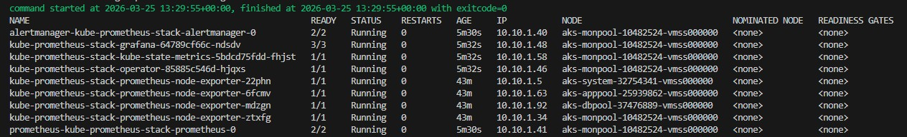
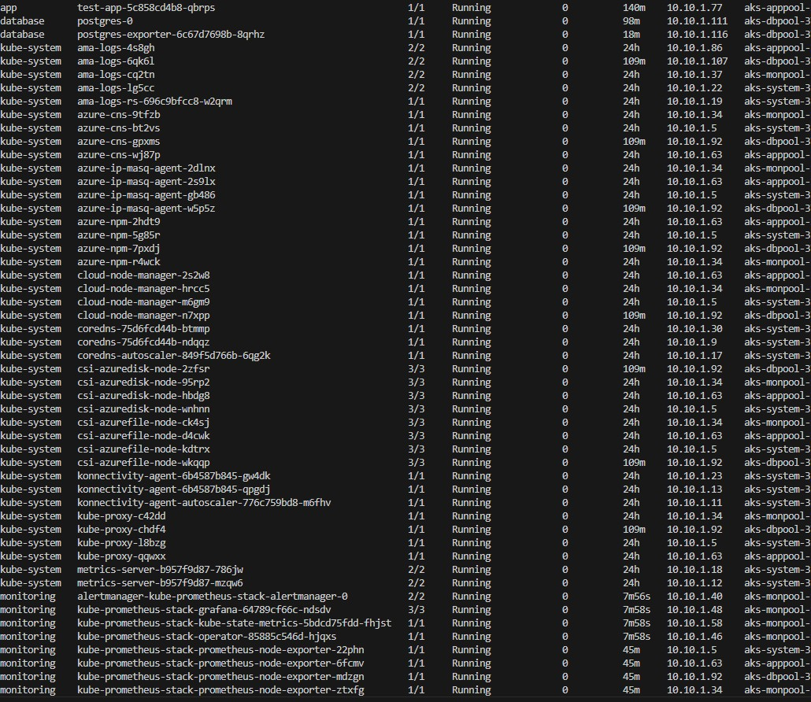
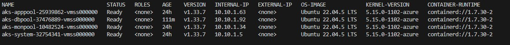
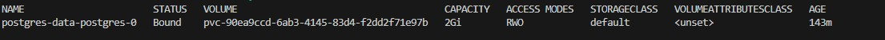
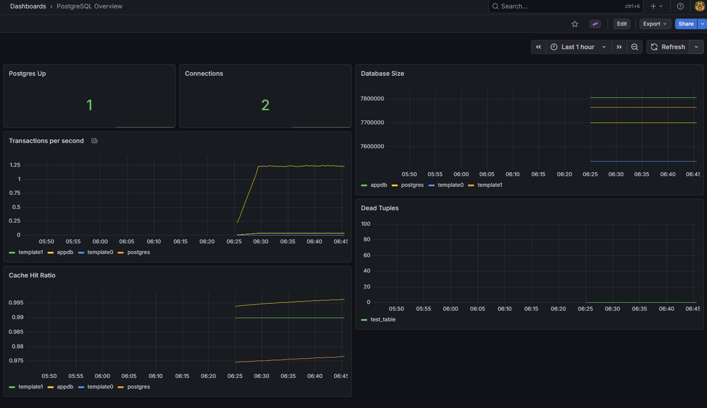
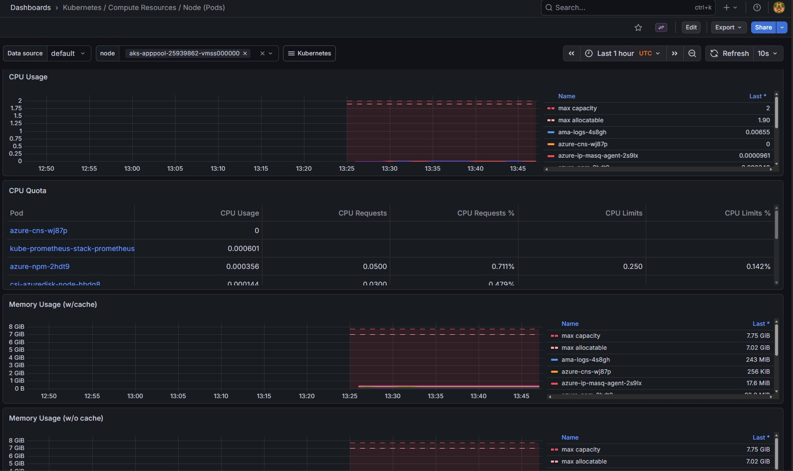

# 🚀 Production-Grade AKS Platform with Monitoring & Stateful Workloads

This project demonstrates a **production-style Kubernetes platform** built on **Azure Kubernetes Service (AKS)**.

It showcases real-world DevOps practices including:

* Infrastructure as Code (Terraform)
* CI/CD pipelines (GitHub Actions)
* Workload isolation using node pools and taints
* Stateful workloads with persistent storage
* Full observability stack (Prometheus + Grafana)

---

## 🧱 Architecture Diagram

### High-Level Architecture

```text
                    ┌─────────────────────────────┐
                    │        GitHub Actions        │
                    │      (CI/CD Pipeline)       │
                    └────────────┬────────────────┘
                                 │
                                 ▼
                    ┌─────────────────────────────┐
                    │ Azure Container Registry    │
                    │           (ACR)             │
                    └────────────┬────────────────┘
                                 │
                                 ▼
                    ┌─────────────────────────────┐
                    │ Azure Kubernetes Service    │
                    │       (Private AKS)         │
                    └────────────┬────────────────┘
                                 │
        ┌───────────────┬────────┼───────────┬───────────────┐
        ▼               ▼        ▼           ▼               ▼
   ┌────────┐     ┌────────┐ ┌────────┐ ┌────────┐     ┌────────┐
   │ system │     │ apppool│ │ dbpool │ │ monpool│     │ Azure  │
   │ nodes  │     │ (app)  │ │ (DB)   │ │monitor │     │ Disk   │
   └────────┘     └────────┘ └────────┘ └────────┘     └────────┘
                         │           │          │
                         ▼           ▼          ▼
                    ┌────────┐  ┌────────┐ ┌─────────────┐
                    │  App   │  │Postgres│ │ Prometheus  │
                    │        │  │Stateful│ │ Grafana     │
                    └────────┘  └────────┘ │ Alertmanager│
                                           └─────────────┘
```

---

## 🧠 Node Pool Strategy

| Pool    | Purpose                         |
| ------- | ------------------------------- |
| system  | Kubernetes core components      |
| apppool | Application workloads           |
| dbpool  | PostgreSQL (stateful workloads) |
| monpool | Monitoring stack                |

Isolation enforced via:

* `nodeSelector`
* `taints & tolerations`

---

## ☁️ Infrastructure (Terraform)

### Provisioned Resources

* Azure Kubernetes Service (private cluster)
* Azure Container Registry (ACR)
* Log Analytics Workspace
* Multiple node pools:

  * system
  * apppool
  * dbpool
  * monpool

### Key Features

* Private API endpoint
* RBAC enabled
* Azure CNI networking
* Autoscaling node pools
* Managed identities

---

## 🔄 CI/CD Pipeline (GitHub Actions)

### 🏗️ Build Stage

Builds Docker image using:

```bash
az acr build
```

### 🚀 Deploy Stage

* Uses Kustomize
* Applies manifests via:

```bash
az aks command invoke
```

### ✅ Verification

* rollout status
* pod health

---

## 🐳 Application Layer

* Node.js application
* Kubernetes Deployment
* ClusterIP Service
* ConfigMap + Secret

### Health Probes

* readiness
* liveness

### Resource Management

* CPU / Memory limits enforced

---

## 🗄️ PostgreSQL (Stateful Workload)

* Deployed as StatefulSet
* Persistent storage via PVC (Azure Disk)

### Storage Architecture

```text
Postgres Pod
     │
     ▼
PersistentVolumeClaim (PVC)
     │
     ▼
PersistentVolume (PV)
     │
     ▼
Azure Managed Disk
```

### ✅ Persistence Validation

* ✔ Data inserted
* ✔ Pod restarted
* ✔ Data still present

---

## 📊 Observability Stack

Installed via Helm:

* Prometheus
* Grafana
* Alertmanager
* kube-state-metrics
* node-exporter

### PostgreSQL Monitoring

* postgres-exporter deployed
* metrics scraped by Prometheus
* custom Grafana dashboard created

---

## 📸 Screenshots

Add your screenshots to:

```
docs/images/
```

### Suggested Screenshots

* 🧠 Workload Distribution


* 🖥️ Node Pools


* 📦 Persistent Storage


* 📊 PostgreSQL Monitoring


* 📈 Kubernetes Cluster Monitoring


* 🧩 Node Monitoring


---

## 🔐 Security

* Private AKS cluster (no public API)
* Grafana exposed temporarily (LoadBalancer)
* reverted back to ClusterIP
* Secrets stored in Kubernetes Secrets
* RBAC enabled

---

## 🧠 Key Concepts Demonstrated

* Kubernetes workload isolation
* Stateful workloads in AKS
* Infrastructure as Code (Terraform)
* CI/CD pipelines (GitHub Actions)
* Observability (Prometheus + Grafana)
* Secure cluster architecture

---

## 🧪 Validation

* ✔ Application deployed and running
* ✔ PostgreSQL persistence verified
* ✔ Prometheus collecting metrics
* ✔ Grafana dashboards populated

---

## 🏁 Summary

This project simulates a real-world production environment, including:

* isolated workloads
* persistent database layer
* monitoring & alerting
* automated deployment pipelines

---

## 🚀 Future Improvements

* Ingress + TLS (NGINX / App Gateway)
* Azure Key Vault integration
* ArgoCD (GitOps)
* PostgreSQL backups
* Horizontal autoscaling
